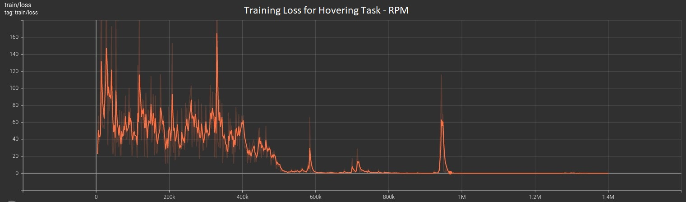
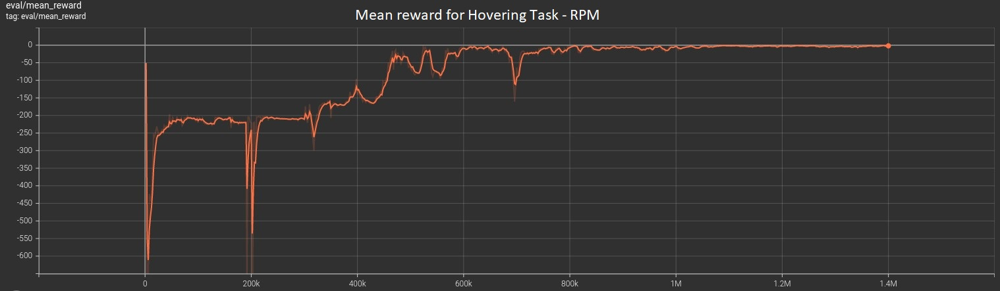

  

# Quadcopter Controller based on Deep Reinforcement Learning

The aim of this project is using a DRL approach in order to complete two tasks with 4-engines drone.
Mainly we focused on Hovering and Movement:
- **Hovering**: holding the initial position. In this case we compared a drone directly controlled by the Neural Network vs. a PID completely tuned using DRL as well.
- **Movement**: moving the drone to a desired position. In this case the PID comparison did not provide any useful result.

   

## Premises and Tools

We employed the physics engine PyBullet and the set of RL algorithm from Stable Baseline, starting with solid background frameworks. 
Our target is showing that even a complex phisics system can be controlled in a fully **model-free** way, getting rid of the expert. Also if the code has to be deployed on a micro-controller, not able to run a Neural Network, the DRL approach provides the means to tune a PID without Control Theory knowledge. 
On the other hand the *very* tough work is generalize and abstract the problems without any domain prior. Finding the right combination of:
- **DRL algorithm**: PPO shows a very good trade-off between results and computing time, but also other algorithms have been tried (like A2C).
- **Training duration and phases**: in some cases, long training times are needed before even noticing an improvement in the loss. Also hybridating different reward functions in more training phases has been beneficial.
- **Reward function**: leading the model to achieve the desisered objective requires an heavy effort of handcrafted mathematical reward functions with many points of choices (basically NP-Hard)
- **Network structure**: starting from an Actor-Critic paradigm, we had to choose the depth of the two networks, the width of each layer and the common netowork part between the two flows

## Experiments

Limited by the Home PC performances, we have tried to meaningful explore the possibility for hyper parameters tuning and for the neural architecture structuring. We evaluated the performances not only from the GUI feedback, but mostly basing our considerations on the final plot of states and engines during the run and the Tensorboard training graphs. All the outputs can be found in [output folder](https://github.com/QuadCtrl/quad-ctrl/tree/main/out) (to be finished).

   

### Algorithm choice and training

We have chosen *Proximal Policy Optimization* (PPO) since, according to OpenAI, approximates the state-of-the-art while being simple to implement and to tune. Other attempts, for exemple using A2C, have shown a strong inconsistency in results and a very sensitive response to small perturbations of the hyper parameters.

In all our experiments we have trained the model for at least 600k timesteps (for the easiest task of PID tuning) and usually between 1 and 1.5 millions (for the hardest task of movement). Every episode lasts 2000 timesteps. For Movement we have also tried succesfully to train the network in more phases, employing more complex reward functions after one million steps such that the already learned patterns are refined. Some Tensorboard result from the [output folder](https://github.com/QuadCtrl/quad-ctrl/tree/main/out):

   

   

   

### Network hyper paramter & settings

The two networks for Actor-Critic in PPO share the same Optimizer ADAM with a learning rate of 0.0003; this choice of an adaptive optimizer is quite forced by the unknow and complex loss landscape made by handcrafted reward functions. The first two layers, in common, are Dense of 128 nodes. The Critic head has always been kept as one dense layer 256 for all the experiments. The Actor head are Denses 128-256 for the Hovering tasks and just 256 for Moving task: one more 128-nodes layer enhances the model capacity but makes the training harder, so is not suitable for the long training sessions required by Moving.

Empiracally trying and testing was our best tool in this case, since there is no a clear heuristic to define the NN architectures. Deeper networks have been stuck generally to higher loss values while passing to 512 nodes Dense slows down drastically the training and requires many timesteps before showing relevant improvements. A trade-off was the key.

### Reward function

It is worth to highlight that for the Hovering task has been adopted the same reward function both for the fully NN control and for the PID tuning. To be more precise we noticed, after many experiments, that the absolute distance on z-axis helps to force the model focusing on holding the altitude before adjusting the x-y position. This is probably due to the fact that in the interval [0,1] the squared distance (used for x-y) is below the simple abs. Some coefficients helps to balance the relevance of the tasks.

For the Moving task we have chosen a combined approach of two reward functions. The first one is heavly biased on just learning to reach the correct altitude with a penalizer that prevents 

## Results

White Noise on all the state observations

white_noise 1 params: mean 0, std 0.03

selective noise 1 : mean 0.2, std 0.05, duration 1 sec (x,z axis)

white_noise 2 params: mean 0, std 0.08

selective noise 2 : mean 0.3, std 0.1, duration 1 sec (x,z axis)

selective noise 3 : mean 0.6, std 0.1, duration 1 sec (x,z axis)

|              | No Noise             | White Noise 1       | Selective Noise 1 | White Noise 2       | Selective Noise 2   | Selective Noise 3   |
|--------------|----------------------|---------------------|-------------------|---------------------|---------------------|---------------------|
| Hovering PID | :heavy_check_mark:   | :heavy_check_mark:  | :heavy_check_mark:| :heavy_check_mark:  | :heavy_check_mark:  | :heavy_check_mark:  |
| Hovering RPM | :heavy_check_mark:   | :heavy_check_mark:* | :heavy_check_mark:| :x:                 | :heavy_check_mark:* | :heavy_check_mark:* |
| Movement RPM | :heavy_check_mark:   | :heavy_check_mark:  | :heavy_check_mark:| :x:                 | :heavy_check_mark:  | :heavy_check_mark:* |

(*) some difficulties
